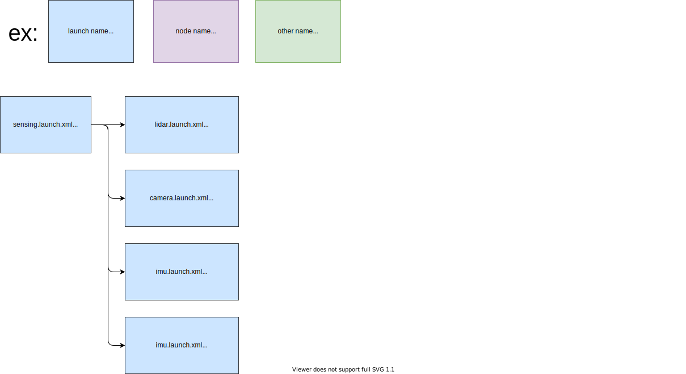

# hvl_sensing_launch

## Structure



## Package Dependencies

Please see `<exec_depend>` in `package.xml`.

## Usage

You can include as follows in `*.launch.xml` to use `sensing.launch.xml`.

```xml
  <include file="$(find-pkg-share hvl_sensing_launch)/launch/sensing.launch.xml">
    <arg name="launch_driver" value="true"/>
    <arg name="sensor_model" value="$(var sensor_model)"/>
    <arg name="vehicle_param_file" value="$(find-pkg-share $(var vehicle_model)_description)/config/vehicle_info.param.yaml"/>
    <arg name="vehicle_mirror_param_file" value="$(find-pkg-share $(var vehicle_model)_description)/config/mirror.param.yaml"/>
  </include>
```

## Launch Directory Structure

This package finds sensor settings of specified sensor model in `launch`.

```bash
launch/
├── aip_x1 # Sensor model name
│   ├── camera.launch.xml # Camera
│   ├── gnss.launch.xml # GNSS
│   ├── imu.launch.xml # IMU
│   ├── lidar.launch.xml # LiDAR
│   └── pointcloud_preprocessor.launch.py # for preprocessing pointcloud
...
```

## Notes

This package finds settings with variables.

ex.)

```xml
<include file="$(find-pkg-share hvl_sensing_launch)/launch/$(var sensor_model)/lidar.launch.xml">
```
